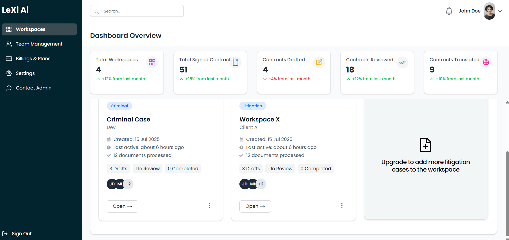

# 🧠 LeXi AI – Legal Workspace Dashboard

LeXi AI is an AI-powered legal workspace dashboard that allows teams to manage case workspaces, upload documents, track status, and view case details including facts and summaries.

> 🚀 Live Demo: [Frontend](https://workspace-dashboard-lofz.vercel.app)  
> 🔗 API: [Backend](https://lexiapi-backend-1.onrender.com)

---

## 📸 Screenshots

### Dashboard View
.

### Workspace Detail
.

---

## 🛠 Tech Stack

### Frontend
- **Next.js** – React framework for server-rendered apps
- **TypeScript** – Strongly typed JavaScript
- **Tailwind CSS** – Utility-first styling
- **Headless UI** – Accessible UI components
- **React Icons** – Icon library

### Backend
- **FastAPI** – Fast, Python-based API framework
- **Render** – Deployment for backend APIs

---

## ✅ Features

- 📁 Create & manage legal case workspaces
- 🧠 AI-ready summary and facts inputs
- 🧾 Upload document and add case details manually or via file
- 👥 Assign team members to cases
- 🧭 View all cases categorized by status (Draft, Review, Completed)
- 🧩 Clean UI with tab navigation (Summary, Facts)

---

## 📦 Getting Started

### 1. Clone the repository

```bash
git clone https://github.com/deepalikonety/workspace-dashboard.git
cd workspace-dashboard

```
### 2. Install dependencies

```bash

npm install

```

### 3. Configure environment variables

Create a .env.local file:
``` bash

env
NEXT_PUBLIC_API_URL=https://lexiapi-backend-1.onrender.com

```

### 4. Start the development server

```bash

npm run dev

```
Visit: http://localhost:3000

### 🧪 Backend API Overview
GET /api/workspaces/ – Fetch all workspaces

POST /api/workspaces/ – Create a new workspace

### Sample POST Payload
json
```bash 
{
  "name": "Criminal Case",
  "client": "Dev",
  "opponent": "Comali",
  "case_type": "Criminal",
  "accused": "XYZ",
  "victim": "ABC",
  "allegations": "Sample allegations here",
  "facts_summary": "Summary of facts goes here",
  "date_of_incident": "2025-07-15",
  "representatives": "JD"
}

```

### 📁 Project Structure
arduino
```bash
workspace-dashboard/
├── components/
│   ├── CaseTabsBlock.tsx
│   └── CaseDetailsModal.tsx
├── pages/
│   ├── index.tsx
│   └── workspace/[id].tsx
├── public/
│   └── screenshots/
├── styles/
├── .env.local
├── README.md
└── ...
```
```
🚧 Future Improvements
🔐 Add authentication (JWT or OAuth)

🧠 Integrate OpenAI for case summary generation

📊 Case metrics dashboard (number of cases by type/status)

📁 Document extraction (PDF to structured data)
```
### 👩‍💻 Author
Deepali Konety
🔗 GitHub: github.com/deepalikonety
